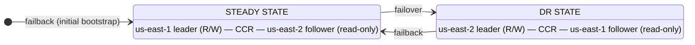
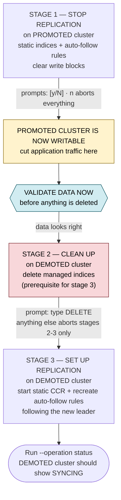
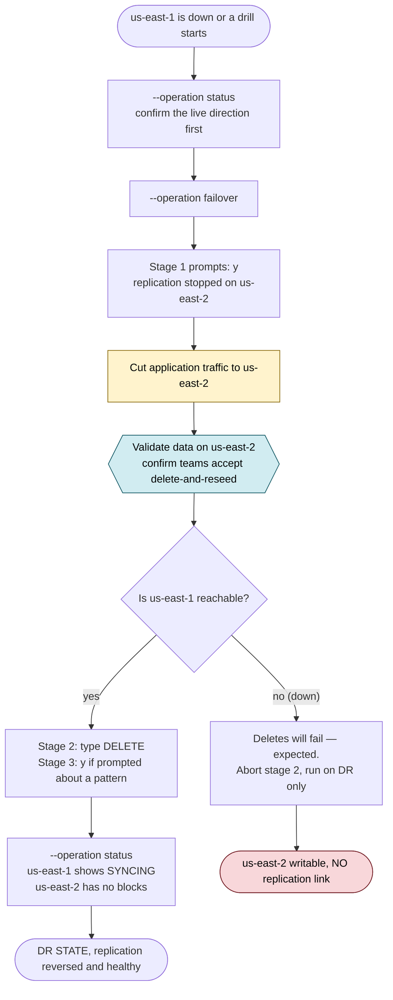
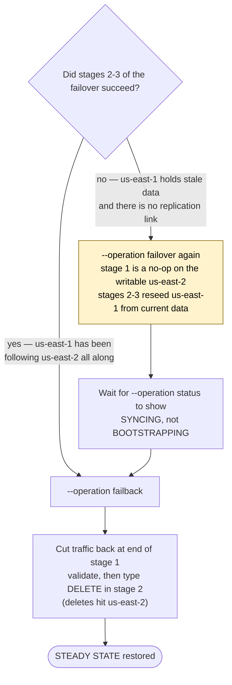

# OpenSearch DR Switchover — User Guide

This guide explains how to run disaster-recovery switchovers between two existing
OpenSearch clusters using `dr-switchover.py`.

---

## 1. Prerequisites

- Two AWS OpenSearch domains exist — one in `us-east-1`, one in `us-east-2`.
- Cross-cluster connections between them (inbound + outbound) are provisioned
  through Terraform and are in the `ACTIVE` state.
- The script **never** creates, accepts, or modifies those connections. It only
  drives the replication plugin on top of them.
- Python 3.9+ with `requests` installed (`pip install -r requirements.txt`).
- Network reachability to **both** domains from wherever you run the script. For
  VPC-attached domains that means a bastion, workload host, or VPN — not a laptop.
- A config file (or env vars / CLI flags) with both endpoints and both connection
  alias names — see section 8.

### The two connection aliases

The script starts replication by referencing an OpenSearch **connection alias**
that must already exist on the follower and point at the leader. Because
replication runs in both directions over the lifetime of a DR event, you need one
alias per direction:

| Config key                   | Default value       | Registered on           | Points to               | Used by      |
| ---------------------------- | ------------------- | ----------------------- | ----------------------- | ------------ |
| `primary_alias_on_secondary` | `primary-cluster`   | `us-east-2` (SECONDARY) | `us-east-1` (PRIMARY)   | **Failback** |
| `secondary_alias_on_primary` | `secondary-cluster` | `us-east-1` (PRIMARY)   | `us-east-2` (SECONDARY) | **Failover** |

Set these to whatever alias names your Terraform created.

> **Verify both alias names before your first real run.** If an alias is wrong or
> its connection is not `ACTIVE`, the run fails at the "start replication" step —
> which happens *after* indices have already been deleted on the demoted cluster.
> You would be left with a promoted cluster and no replication link.

---

## 2. Leader, follower, and what "failover" actually means

Cross-cluster replication (CCR) is one-directional. One cluster is the **leader**
(read/write, applications point here), the other is the **follower** (a live copy
whose replicated indices are read-only, enforced by index write blocks).

In this tool, **failover and failback are not events — they are directions.**
Each operation flips which cluster holds the leader role:



Throughout the script and this guide:

| Term          | Means                                                              | Your setup  |
| ------------- | ------------------------------------------------------------------ | ----------- |
| **PRIMARY**   | The cluster that is the leader in the normal, steady state         | `us-east-1` |
| **SECONDARY** | The DR cluster that follows PRIMARY in the normal, steady state    | `us-east-2` |

These labels are fixed to a region, not to the current role. `us-east-1` stays
"PRIMARY" in config even while it is temporarily a follower during a DR event.
That is why you must always check `status` before acting — the label does not
tell you the live direction.

---

## 3. Operations

The script supports exactly three operations.

```bash
python3 dr-switchover.py --operation status     # read-only inspection
python3 dr-switchover.py --operation failover   # make us-east-2 the leader
python3 dr-switchover.py --operation failback   # make us-east-1 the leader
python3 dr-switchover.py                        # interactive menu (1/2/3/4)
```

| Operation    | Effect                                                                    | Destructive |
| ------------ | ------------------------------------------------------------------------- | ----------- |
| **status**   | Prints health, per-index CCR state, write blocks, auto-follow stats       | No          |
| **failover** | Promotes SECONDARY to leader; PRIMARY becomes the follower                 | Yes         |
| **failback** | Promotes PRIMARY to leader; SECONDARY becomes the follower                | Yes         |

`status` is safe to run at any time and is the only way to know the live
direction. Read it as follows: whichever cluster shows `SYNCING` and has write
blocks on the managed indices is the **follower**; the other is the leader.

---

## 4. Stages of a switchover, and where you are asked for input

Failover and failback are the **same three stages**, applied to opposite clusters.
Stage 1 promotes one cluster to leader; stages 2–3 demote the other and rebuild
replication in the new direction.

| Operation    | PROMOTED (stage 1)      | DEMOTED (stages 2–3)    |
| ------------ | ----------------------- | ----------------------- |
| **failover** | `us-east-2` (SECONDARY) | `us-east-1` (PRIMARY)   |
| **failback** | `us-east-1` (PRIMARY)   | `us-east-2` (SECONDARY) |



### Stage 1 — Stop replication on the cluster being promoted

This stage makes the promoted cluster writable. It covers **both** index types:

- **Static indices** — calls `_stop` on each, then clears `blocks.write`,
  `blocks.read_only`, and `blocks.read_only_allow_delete`.
- **Auto-follow rules** — for each rule, discovers every live index matching the
  pattern, stops replication and clears write blocks on each, then deletes the
  rule itself.

Auto-follow needs that per-index sweep because deleting a rule in OpenSearch only
stops *new* indices from being picked up. Indices the rule already created stay
read-only and keep replicating, so without this they would remain unwritable
after promotion.

**Prompts:** one `[y/N]` for the static indices, one `[y/N]` for the auto-follow
rules. Each appears only when that type is configured.
**Can you skip them?** No — answering `n` aborts the whole operation. Skipping
only makes sense if replication was already stopped by hand, in which case the
calls are no-ops anyway (already-stopped and 404 responses count as success).

If a write block fails to clear you get an extra `Proceed anyway?` prompt. Answer
`y` only after reading the errors — an index that stays blocked will not accept
application writes even though the operation reports success.

Once this stage finishes, the script prints that the promoted cluster is active
and writable. **This is where you cut application traffic over.** Stages 2–3 only
rebuild replication in the reverse direction and can be run later if needed.

> ### Validate before you let stage 2 delete anything
>
> Stage 1 has stopped replication but nothing has been destroyed yet. This is the
> **only safe window** to check that the promoted cluster actually holds the data
> you expect — document counts, newest timestamps, a few spot-check queries
> against the indices your teams care about.
>
> ```bash
> curl "$PROMOTED_URL/_cat/indices?v&s=index"
> curl "$PROMOTED_URL/orders/_count"
> curl "$PROMOTED_URL/orders/_search?size=1&sort=@timestamp:desc"
> ```
>
> Also confirm with the **owning teams** that they accept resync by delete-and-reseed.
> Stage 2 does not merge or reconcile: the demoted cluster's copy is thrown away
> and rebuilt from the promoted cluster. Any writes that landed only on the demoted
> cluster — for example during a split-brain window, or writes an application made
> to it before traffic was cut over — are lost with no way to recover them from CCR.
> If a team needs those writes, snapshot the demoted cluster or export the affected
> indices **before** you continue.
>
> If the data does not look right, stop here. A writable promoted cluster with no
> replication is a valid state to sit in while you investigate.

### Stage 2 — Clean up indices on the cluster being demoted

CCR cannot start on a follower index that already exists. The cluster being
demoted still holds its own copy of every managed index from when it was the
leader, so those copies must be deleted before stage 3 can establish replication
in the new direction. **Stage 2 exists purely as a prerequisite for stage 3** —
without it, stage 3 cannot run.

What gets collected into the delete list:

- Each static index. If one is still an active CCR follower (`SYNCING`,
  `BOOTSTRAPPING`, `PAUSED`) it is stopped and unblocked first so it can be deleted.
- Every index on that cluster matching each configured auto-follow pattern.

**Prompt:** the full list of indices to be deleted, then
`Type DELETE (uppercase) to confirm`. A typed word is required so an accidental
Enter can never trigger data loss — this is the single destructive part of both
operations.
**Can you skip it?** Yes — anything other than `DELETE` aborts *stages 2–3 only*.
The promotion from stage 1 stands, and you are left with a writable promoted
cluster and no replication. That is a legitimate state during a real incident;
you can run the operation again later to establish replication.

At this moment the promoted cluster is the **only** source of truth. Never type
`DELETE` before completing the validation above.

### Stage 3 — Set up replication on the cluster being demoted

With the demoted cluster cleared, replication is established in the new direction.
Again both index types are covered:

- **Static indices** — explicit `_start` per index against the new leader's
  connection alias, with up to `retry_max_attempts` tries and exponential backoff.
- **Auto-follow rules** — each configured rule is recreated on the demoted cluster
  pointing at the new leader. OpenSearch then picks up matching indices itself, so
  the script deliberately does not `_start` those individually.

Rule creation is idempotent: a rule that already exists with the same pattern is
skipped, and one that exists with a *different* pattern triggers a prompt —
`Replace existing auto-follow rule 'x' (pattern: 'old' → 'new')?`. Answer `y` only
if you intentionally changed the pattern in your indices file.

Rule recreation runs only if the deletes and static starts succeeded.

---

## 5. Running a real DR event

Your steady state is `us-east-1` as leader. That direction is established by a
**failback** — which is also how you bootstrap replication for the first time.

| Situation                                                 | Operation to run |
| --------------------------------------------------------- | ---------------- |
| Initial setup / bootstrap replication into `us-east-2`     | `failback`       |
| `us-east-1` is down or degraded — activate DR              | `failover`       |
| Planned DR drill                                           | `failover`       |
| `us-east-1` is healthy again — return to steady state      | `failback`       |

### The actual DR sequence



### Resyncing data back to `us-east-1`

`us-east-2` accumulated writes while it was the leader. Which path you take
depends on whether stages 2–3 of the failover completed:



Running `failback` directly in the second case would promote the stale cluster —
that is the mistake this branch exists to prevent.

Use `find-missing-replication-indices.py` if you suspect individual indices were
never replicated — it diffs both clusters and emits ready-to-run `curl` commands
to start CCR for whatever is missing.

```bash
python3 find-missing-replication-indices.py --config ./config.json \
  --direction secondary-to-primary
```

---

## 6. Index types the script supports

Every entry in the indices file becomes **exactly one** of two things. There is no
overlap: if `autofollow` is `true`, the entry is an auto-follow rule only, even if
it has a `name`.

### Static index — explicit, named replication

An index you replicate by exact name. Use this for a small, stable set.

```json
{
  "name": "orders",
  "description": "Customer orders",
  "autofollow": false
}
```

The script stops, unblocks, deletes, and issues `_start` for this exact name.
Static indices are the only ones that appear in the per-index tables in `status`.

### Auto-follow rule — pattern-based replication

OpenSearch watches the leader and automatically starts replication for any index
whose name matches the pattern. Use this for index families that grow over time.

`autofollow_pattern` is **required** whenever `autofollow` is `true`, and is never
inferred from `name`. Missing it is a fatal error — the script exits.

The two fields do different jobs:

```
name:               metrics-idx      ← rule identifier sent to OpenSearch, no wildcards
autofollow_pattern: metrics-idx*     ← wildcard matched against leader index names
```

With a rule name:

```json
{
  "name": "products",
  "description": "Product catalog family",
  "autofollow": true,
  "autofollow_pattern": "products*"
}
```

Without one — the rule name is derived by stripping `*` and `?` from the pattern
and trimming trailing `-`/`_`, so `metrics-idx*` becomes rule `metrics-idx`:

```json
{
  "description": "Metrics family",
  "autofollow": true,
  "autofollow_pattern": "metrics-idx*"
}
```

The script does not call `_start` for pattern-matched indices. The rule does that.
The script's job is to tear the rule down on the promoted cluster (stage 1) and
recreate it on the demoted cluster (stage 3).

---

## 7. The indices file

Default path `./indices.json`, overridable with `--indices-file`,
`OPENSEARCH_INDICES_FILE`, or `indices_file` in the config file. It is read fresh
on every run — no restart or cache to worry about.

```json
{
  "indices": [
    { "name": "orders",   "description": "Customer orders",  "autofollow": false },
    { "name": "users",    "description": "User profiles",    "autofollow": false },
    { "name": "products", "description": "Product family",
      "autofollow": true, "autofollow_pattern": "products*" },
    { "description": "Metrics family",
      "autofollow": true, "autofollow_pattern": "metrics-idx*" }
  ]
}
```

| Field                 | Required                              | Purpose                                       | Notes                            |
| --------------------- | ------------------------------------- | --------------------------------------------- | -------------------------------- |
| `name`                | Static: yes. Auto-follow: optional    | Static index name, or auto-follow rule name   | Must not contain `*` or `?`      |
| `autofollow`          | No (defaults to `false`)              | Chooses static vs auto-follow                 | `true` = auto-follow only        |
| `autofollow_pattern`  | Yes when `autofollow` is `true`       | Wildcard matched on the leader                | e.g. `products*`, `logs-2026-*`  |
| `description`         | No                                    | Human note                                    | Ignored by the script            |
| `shards` / `replicas` | No                                    | Not used                                      | Ignored by the script            |

The file above resolves to:

| Bucket           | Entries                                                  |
| ---------------- | -------------------------------------------------------- |
| Static indices   | `orders`, `users`                                        |
| Auto-follow rules| `products` → `products*`, `metrics-idx` → `metrics-idx*` |

At least one static index **or** one valid auto-follow rule is required; an
otherwise empty file is a fatal error.

### Changing the managed set

Removing an entry only stops the script from managing it. Existing CCR or
auto-follow rules on the clusters are not cleaned up until you remove them by
hand. Adding a static index means creating it on the current leader and starting
CCR once on the follower — the script's `_start` calls only run during a
switchover.

---

## 8. Configuration

Precedence, highest wins:

1. CLI flags
2. Environment variables
3. Config file (`--config path/to/config.json`)
4. Built-in defaults

A config file is the practical choice for two fixed regions.

```json
{
  "primary_url": "https://vpc-search-use1.us-east-1.es.amazonaws.com",
  "secondary_url": "https://vpc-search-use2.us-east-2.es.amazonaws.com",
  "indices_file": "./indices.json",
  "primary_alias_on_secondary": "primary-cluster",
  "secondary_alias_on_primary": "secondary-cluster",
  "username": "",
  "password": "",
  "verify_ssl": true,
  "retry_max_attempts": 3,
  "retry_base_delay": 2.0
}
```

| Key                          | Meaning                                              | Default                 |
| ---------------------------- | ---------------------------------------------------- | ----------------------- |
| `primary_url`                | Endpoint of the steady-state leader (`us-east-1`)    | —                       |
| `secondary_url`              | Endpoint of the DR cluster (`us-east-2`)             | —                       |
| `indices_file`               | Path to the indices file                             | `./indices.json`        |
| `primary_alias_on_secondary` | Alias on SECONDARY → PRIMARY (failback)              | `primary-cluster`       |
| `secondary_alias_on_primary` | Alias on PRIMARY → SECONDARY (failover)              | `secondary-cluster`     |
| `username` / `password`      | Basic auth, if the domains use it                    | empty                   |
| `verify_ssl`                 | TLS verification                                     | `true`                  |
| `retry_max_attempts`         | `_start` attempts per index                          | `3`                     |
| `retry_base_delay`           | Base backoff seconds between attempts                | `2.0`                   |

Equivalent environment variables: `OPENSEARCH_PRIMARY_URL`,
`OPENSEARCH_SECONDARY_URL`, `OPENSEARCH_INDICES_FILE`,
`OPENSEARCH_PRIMARY_ALIAS`, `OPENSEARCH_SECONDARY_ALIAS`,
`OPENSEARCH_USERNAME`, `OPENSEARCH_PASSWORD`, `OPENSEARCH_RETRY_MAX`,
`OPENSEARCH_RETRY_DELAY`.

The script must run from somewhere that can reach both domains — if they are
VPC-attached, that means a bastion, workload host, or VPN, not a laptop.

```bash
python3 -m venv .venv && source .venv/bin/activate
pip install -r requirements.txt
python3 dr-switchover.py --config ./config.json --operation status
```

---

## 9. Rehearsal and automation flags

| Flag                | Behaviour                                                                                                     |
| ------------------- | ------------------------------------------------------------------------------------------------------------- |
| `--dry-run`         | Logs every `POST`/`PUT`/`DELETE` it *would* send and skips all confirmations. `GET`s still run, so discovery and status are real. Nothing is mutated. |
| `--non-interactive` | Auto-confirms every prompt, **including the typed `DELETE`**. For CI only.                                     |
| `--no-colour`       | Strips ANSI codes — useful when piping to a log.                                                              |

Always rehearse a new config or a changed indices file with a dry run first:

```bash
python3 dr-switchover.py --config ./config.json --dry-run --operation failover
```

---

## 10. Troubleshooting

| Symptom                                                       | Cause                                                    | Action                                                                                     |
| ------------------------------------------------------------- | -------------------------------------------------------- | ------------------------------------------------------------------------------------------ |
| `autofollow: true requires 'autofollow_pattern'`              | Pattern missing on an auto-follow entry                  | Add `autofollow_pattern`, or set `autofollow` to `false`                                    |
| `indices.json has no named indices and no autofollow rules`   | Empty or fully invalid indices file                      | Fix the file                                                                               |
| Alias / remote-cluster error at the `_start` step             | Alias name wrong, or the connection is not `ACTIVE`      | Check the Terraform-managed connections and the two alias config keys (section 1)          |
| HTTP 403 `FORBIDDEN/1000` on delete                           | Index is still a CCR follower                            | The script stops and unblocks before retrying; if it persists, stop replication manually   |
| Stage 2 lists only static indices, not the pattern-matched    | Pattern is wrong, or those indices don't exist there     | Verify with `_cat/indices` and check the pattern                                           |
| `status` shows `SYNCING` on the cluster you thought was leader | You are already in the reversed state                    | Run the *other* operation. Never assume failover is the next step                          |
| `BOOTSTRAPPING` for a long time                               | Initial snapshot copy still in progress                  | Wait, and watch shard/index size. Do not start another switchover mid-bootstrap            |
| Connection timeouts                                           | No network path from where you are running the script    | Run from inside the VPC, or connect via VPN                                                |

Manual stop and unblock, as a last resort:

```bash
curl -X POST "$URL/_plugins/_replication/orders/_stop" \
  -H 'Content-Type: application/json' -d '{}'

curl -X PUT "$URL/orders/_settings" -H 'Content-Type: application/json' \
  -d '{"index":{"blocks.write":null,"blocks.read_only":null,"blocks.read_only_allow_delete":null}}'
```

---

## 11. Safety rules

1. Run `--operation status` before every failover and failback. The PRIMARY/SECONDARY
   labels describe your config, not the live direction.
2. Dry-run any new config file, endpoint, or indices file before using it for real.
3. Validate data on the promoted cluster after stage 1 and before stage 2, and
   confirm the owning teams accept resync by delete-and-reseed. Stage 2 discards
   the demoted cluster's copy; writes that exist only there cannot be recovered.
4. Stage 2 deletes indices. Type `DELETE` only after confirming the other cluster
   is healthy and holds the data you intend to keep.
5. Move application traffic at the end of stage 1, not at the end of the run.
6. Never run `--non-interactive` against a production domain unless the whole
   sequence has been rehearsed with the same config. It auto-confirms the typed
   `DELETE`, so no one gets a chance to validate.
7. Do not start a second switchover while indices are still `BOOTSTRAPPING`.

---

## 12. Approach per team

Which teams use which replication approach for their indices.

| Team | Indices / patterns | Static or auto-follow | Notes |
| ---- | ------------------ | --------------------- | ----- |
|      |                    |                       |       |
|      |                    |                       |       |
|      |                    |                       |       |
